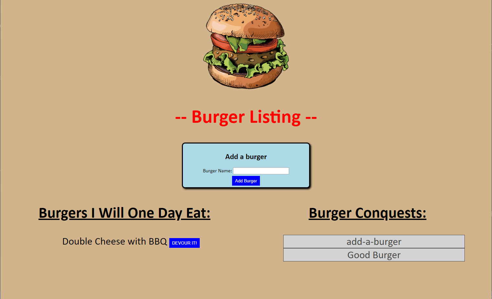

# Burger Lister

## Description: 
This app allows the user to create a list of all the burgers they would like to eat.  Once the User has eaten the burger, they can move it to the "Conquered Burgers" side of the page and keep it as a memory of the mighty burgers that have fallen before. 

View the deployed app [HERE](https://kinda-good-burger.herokuapp.com/).

## Contributing:

## Questions:
* GitHub Profile:  [the-medium-place](https://github.com/the-medium-place)
* Email: <zgstowell@gmail.com>

